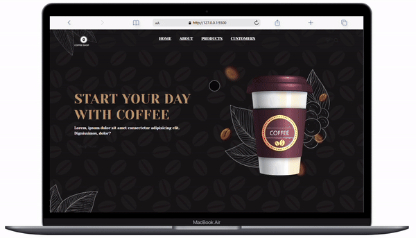

# 📌 Contents of my fullstack projects and lecture notes

It contains my repo information covering both front-end and back-end aspects of my software development process. In this context, I took notes on the methods 
I saw in both paths during the training process and tried to apply them practically to the projects. If you would like to help me in my development regarding the content, you can let me know. Thank you in advance.

---

[Live](https://yavuzahmet1.github.io/fullstack-clarusway/projects/coffee-shop/)

---

## 📋 İçindekiler

1. [Hakkında](#hakkında)
2. [Özellikler](#özellikler)
3. [Kurulum](#kurulum)
4. [Kullanım](#kullanım)
5. [Katkıda Bulunma](#katkıda-bulunma)
6. [Lisans](#lisans)
7. [İletişim](#iletişim)

---

## 🔍 Hakkında

Dünyanın dört bir yanından gelen kahve tutkunlarına hitap eden bir marka yaratma hayaliyle yola çıktık. Web sitemiz, sadece bir kahve dükkanı olmanın ötesinde, kahve severlerin tutkularını paylaşabilecekleri bir topluluk oluşturmayı amaçlıyor. Modern tasarımı ve kullanıcı dostu yapısıyla, kahve dünyasına açılan bir kapı olmayı hedefliyoruz. Kahve seçiminden, demleme yöntemlerine kadar her detayı sizin için düşündük. Sıcak bir fincan kahve eşliğinde, hikayemizin bir parçası olmaya davetlisiniz!

---

## ✨ Özellikler

- [ ] Modern Tasarım: Flexbox ve Grid yapılarını harmanlayan düzenimiz, her ekran boyutuna uyum sağlayarak kullanıcılarınıza benzersiz bir deneyim sunar.
- [ ] Hızlı ve Duyarlı: Bootstrap'in gücünden yararlanarak hızlı yükleme süreleri ve mobil cihazlar için optimize edilmiş bir site sunuyoruz.
- [ ] Dinamik İçerik: Menü seçeneklerinden, promosyonlara kadar her şeyi kolayca güncelleyebileceğiniz bir yapıya sahiptir.
- [ ] Blog ve yorumlar: yorumlar ve ürünlerimiz kahve kültürüne dair her şey!

---

## 🛠️ Web sitemizi hızlıca kurmak ve kullanmaya başlamak için aşağıdaki adımları izleyin:

- [ ] Dosyaların İndirilmesi: Web sitesi dosyalarını GitHub ya da sağlanan diğer kaynaklardan indirin.
- [ ] Bootstrap ve Kütüphaneler: Projenizde gerekli Bootstrap dosyalarının ve diğer bağımlılıkların (CSS ve JS) yüklü olduğundan emin olun.
- [ ] Test ve Yayınlama: Siteyi farklı cihazlarda test edin ve yayınlayın!

